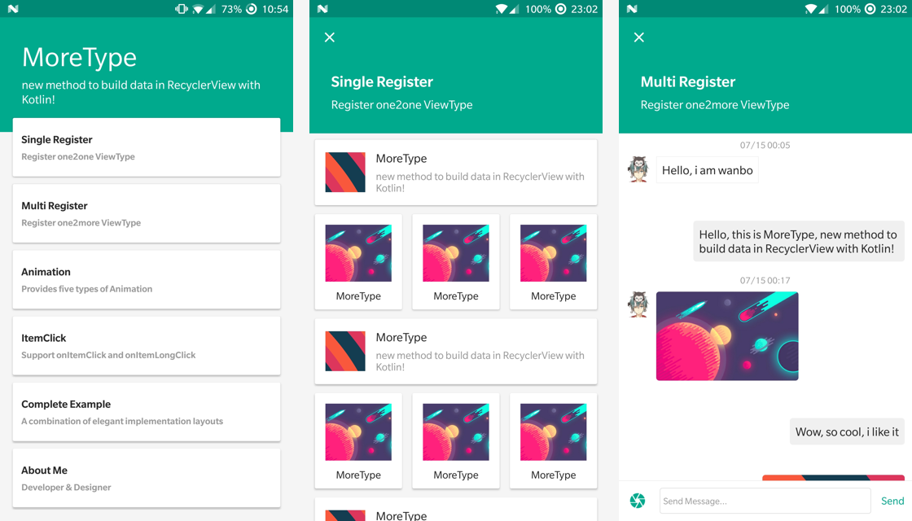
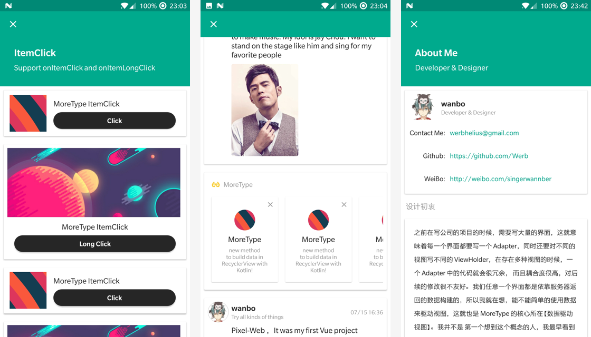

# MoreType

> new method to build data in RecyclerView with Kotlin!

<a href="https://fir.im/k9yq"></a>

Click icon download lastest sample

English | [中文版](https://github.com/Werb/MoreType/blob/master/README_ZH.md)

[](https://travis-ci.org/Werb/MoreType)
[](https://github.com/Werb/MoreType/blob/master/LICENSE)
 [  ](https://bintray.com/werbhelius/maven/moretype/_latestVersion)
 [](https://android-arsenal.com/api?level=16)

Keyword: Data driven view 【数据驱动视图】

Before writing a project in the company, we need to write a large number of recyclerViews to display data, which means that each recyclerView must write an Adapter, but also for different views according to getItemViewType () write different ViewHolder, in the presence of multiple views Time, an adapter in the code will be very redundant, And the coupling is very high, the follow-up changes are very friendly. 

**Any of our recyclerViews are based on the data returned by the server to build, so I was wondering, can not simply use the data to drive the view, which is the core of the MoreType 【data driven view】.**

I am not The first thought of this concept, I first saw the concept of practice, is [drakeet's MultiType](https://github.com/drakeet/MultiType). After watching his project, i know this is what I hope [Data driven view]. 

**Kotlin on Android Now official.** Don't have to worry about the NullPointerException, simple code style, in the first time I like to like it, so I decided to use Kotlin to develop a **【data-driven view】** third-party library  of the , this was MoreType **【Give you more likely】**.

**This is a beta version, because it is based on the development of AS Preview, there may be some unknown Bug.**

**Release Version will be published at the end of the month.**

## Preview



## Dependency
```gradle
compile 'com.werb.moretype:moretype:0.1.8'
compile "org.jetbrains.kotlin:kotlin-reflect:$kotlin_version"
```
or
```gradle
implementation 'com.werb.moretype:moretype:0.1.8'
implementation "org.jetbrains.kotlin:kotlin-reflect:$kotlin_version"
```

## Usage

Keyword: Data driven view 【数据驱动视图】

#### Step 1. create a data model class, like:
```kotlin
data class SingleText(val title: String, val desc: String, val url: String)
```
or
```kotlin
class SingleText {
    var title: String? = null
    var desc: String? = null
    var url: String? = null
}
```

### Step 2. create a class (xxxViewType) extends abstract class `MoreViewType<T : Any>(layoutId)` , like:

```kotlin
class SingleTypeOneViewType: MoreViewType<SingleText>(R.layout.item_view_single_type_one) {

    private lateinit var title: AppCompatTextView
    private lateinit var desc: AppCompatTextView
    private lateinit var icon: SimpleDraweeView

    override fun initView(holder: MoreViewHolder) {
        title = holder.findViewOften(R.id.title)
        desc = holder.findViewOften(R.id.desc)
        icon = holder.findViewOften(R.id.icon)

        // findViewOften() will cache and reuse view after first findViewBtId
    }

    override fun bindData(data: SingleText, holder: MoreViewHolder) {
        title.text = data.title
        desc.text = data.desc
        icon.setImageURI(data.url)
    }
}
```

### Step 3. `register` and `attach` to `recyclerview` in Any where you build list, like:

```kotlin
import kotlinx.android.synthetic.main.activity_single_register.*

class SingleRegisterActivity: AppCompatActivity() {

    private val adapter = MoreAdapter()

    override fun onCreate(savedInstanceState: Bundle?) {
        super.onCreate(savedInstanceState)
        setContentView(R.layout.activity_single_register)

        list.layoutManager = LinearLayoutManager(this)

        /* register viewType and attach to recyclerView */
        adapter.register(TitleViewType())
                .register(SingleTypeOneViewType())
                .attachTo(list)

        /* load any data List or model object */
        adapter.loadData(DataServer.getSingleRegisterData())

    }

}
```

**For use with `kotlin-android-extensions` to replace findViewById()**

Upon completion of these three steps, a list based on the [Data Driven View] has been completed.

## Feature
### Multi Register: Register one2more ViewType

Usually data and view are one-to-one relationships, like Feeds list, MoreType alse provide Multi Register like IM list, one data to Many views, MoreType can do it easily.

```kotlin
adapter.register(TitleViewType())
        .multiRegister(Message::class, object : MultiLink<Message> {
            override fun link(data: Message): MoreViewType<Message>? {
                if (data.me) {
                    return MessageOutViewType()
                } else {
                    return MessageInViewType()
                }
            }
        })
        .attachTo(multi_register_list)
```
**Multi Register must explicit declare data class**


### Animation: Provides five types of Animation

Provide 5 animations: **Alpha** , **Scale** , **SlideInBottom** , **SlideInLeft** , **SlideInRight**

```Kotlin
    adapter.register(TitleViewType())
            .register(AnimViewType())
            /* assign Animation */
            .renderWithAnimation(AlphaAnimation())
            /* set Animation start position in list */
            .startAnimPosition(1)
            /* set is always show animation or show in first display */
            .firstShowAnim(true)
            .attachTo(anim_list)
```

Also suppost custom Animation, create a class implement `MoreAnimation` and override `getItemAnimators(view: View)` , like:
```kotlin
class SlideInLeftAnimation : MoreAnimation {

    override fun getItemAnimators(view: View): Array<Animator>{
        return arrayOf(ObjectAnimator.ofFloat(view, "translationX", -view.rootView.width.toFloat(), 0f))
    }

}
```

### ItemClick: Support onItemClick and onItemLongClick

Two ways to achieve ItemClick: **In ViewType** and **In Activity**

**In ViewType** : Just use `view.setOnClickListener {}` in ViewType

**In Activity** : 
1. use `holder.addOnClickListener(view: View)` or `holder.addOnClickListener(viewId: Int)` to bind event in ViewType
2. use `viewType().setMoreClickListener()` to deal event in Activity

[sample](https://github.com/Werb/MoreType/tree/master/app/src/main/java/com/werb/moretype/click)

### Refresh and loadMore
**Refresh**: use `SwipeRefreshLayout`

**LoadMore**: build `Footer.class` and `FootViewType` , when list smooth to last position - 1, show  `FootViewType` and remove `FootViewType`  when new data load successful

[sample](https://github.com/Werb/MoreType/blob/master/app/src/main/java/com/werb/moretype/complete/CompleteActivity.kt)

### Sole Global ViewType
**Register global viewType in Custom Application**
```kotlin
class MyApp: Application() {

   companion object {
       @Volatile lateinit var myApp: MyApp
           private set
   }

    override fun onCreate() {
        super.onCreate()
        myApp = this
        // Sole Global Register, like footer , Cutting line
        MoreType.soleRegister(FoorViewType())
    }
}
```

and we can use it in any where with `adapter.userSoleRegister()`

## Thanks
[MultiType](https://github.com/drakeet/MultiType)

[recyclerview-animators](https://github.com/wasabeef/recyclerview-animators)

## LICENSE
[Apache License](./LICENSE)


